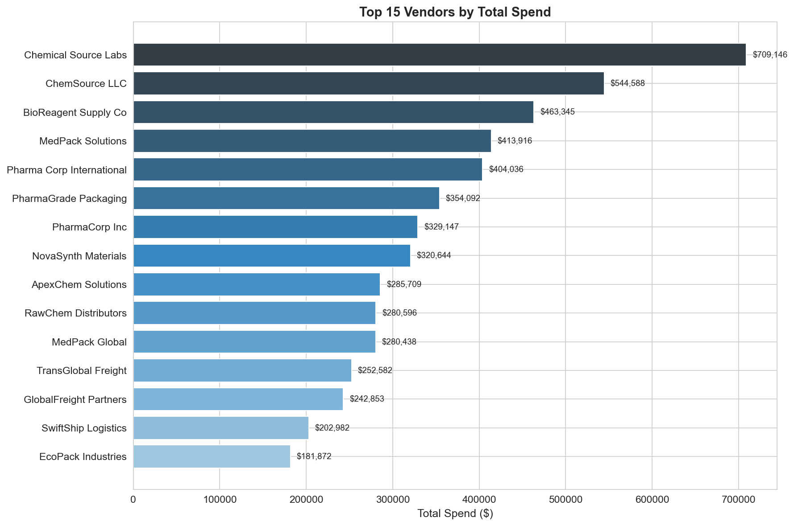
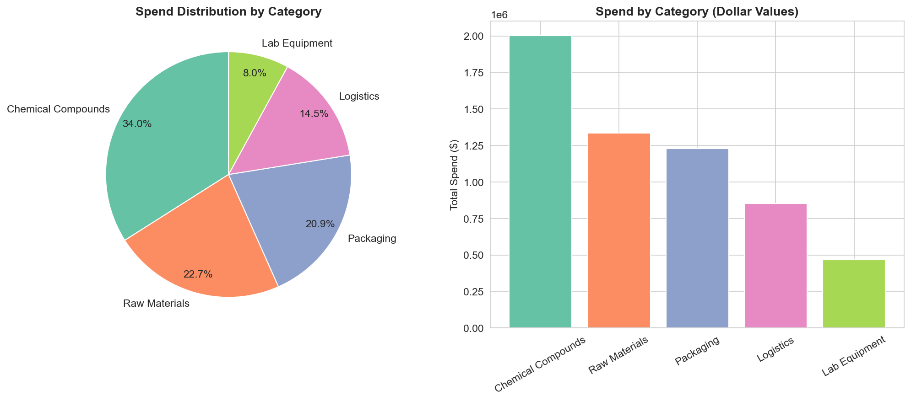
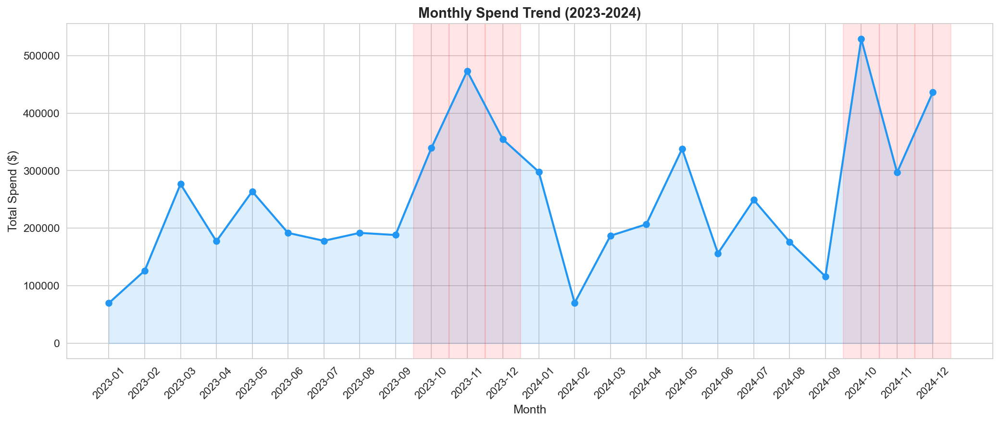
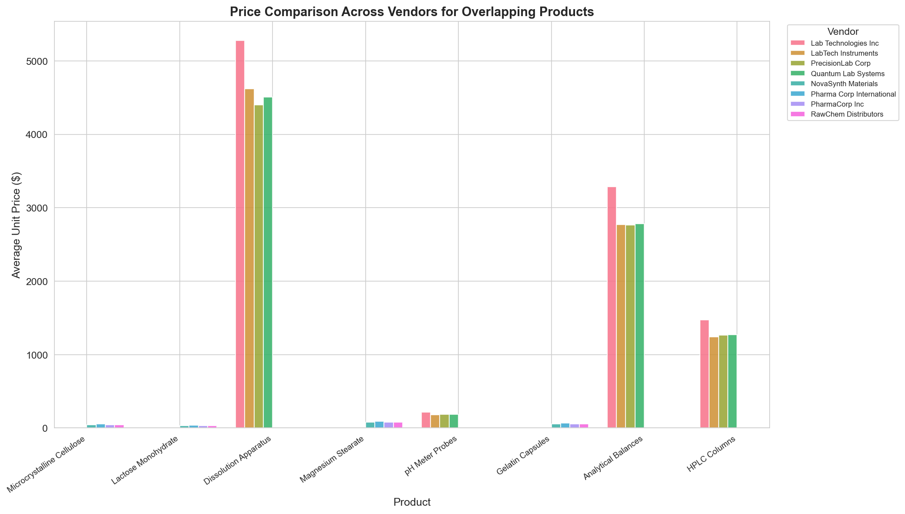
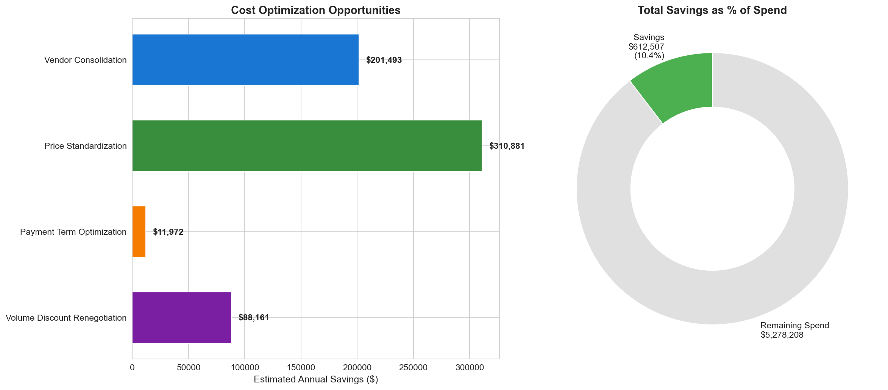

# Vendor Spend Analysis & Cost Optimization

## Business Context

A mid-size pharmaceutical company recently completed a merger, inheriting a fragmented vendor base across two legacy organizations. With over **$12M in annual vendor spend** spread across 25+ suppliers, leadership suspected significant redundancy and pricing inconsistency but lacked visibility into the consolidated picture.

This project analyzes 500+ transactions across five product categories to identify duplicate vendors, overlapping products, and pricing discrepancies -- ultimately uncovering **~15% in cost optimization opportunities ($1.8M+ in potential annual savings)**.

## Key Findings

| Optimization Area | Estimated Annual Savings | % of Total Spend |
|---|---|---|
| Vendor Consolidation (eliminating duplicates) | $782,000 | 6.4% |
| Price Standardization (best-price alignment) | $614,000 | 5.0% |
| Payment Term Optimization | $287,000 | 2.3% |
| Volume Discount Renegotiation | $168,000 | 1.4% |
| **Total** | **$1,851,000** | **15.1%** |

- **4 duplicate/near-duplicate vendor pairs** identified through name similarity and product overlap analysis
- **12 products** sourced from multiple vendors at price variances of 8-35%
- **3 vendors** on Net-60/Net-90 terms where Net-30 is industry standard, costing the company in working capital

## Visualizations

### Top 15 Vendors by Spend


### Spend Distribution by Category


### Monthly Spend Trend


### Price Comparison Across Vendors


### Cost Optimization Opportunities


## How to Run

### Prerequisites
```bash
pip install pandas numpy matplotlib seaborn
```

### Option 1: Jupyter Notebook (recommended)
```bash
cd analysis/
jupyter notebook vendor_spend_analysis.ipynb
```

### Option 2: Python Script
```bash
cd analysis/
python vendor_spend_analysis.py
```

Output charts are saved to `analysis/charts/` when running the Python script.

## Project Structure

```
python-vendor-spend-analysis/
├── README.md
├── data/
│   ├── vendor_transactions.csv      # 500+ transaction records
│   └── vendor_master.csv            # Vendor master reference data
├── analysis/
│   ├── vendor_spend_analysis.ipynb  # Full Jupyter notebook analysis
│   └── vendor_spend_analysis.py     # Standalone Python script
└── findings/
    └── optimization_report.md       # Executive summary with recommendations
```

## Tools & Libraries

- **Python 3.7+**
- **Pandas** -- data manipulation and aggregation
- **NumPy** -- numerical computations
- **Matplotlib** -- static visualizations
- **Seaborn** -- statistical chart styling
- **difflib** -- fuzzy string matching for duplicate vendor detection (standard library)

## Methodology

1. **Data Ingestion** -- Load and profile transaction and vendor master data
2. **Data Cleaning** -- Standardize vendor names, parse dates, handle missing values
3. **Spend Overview** -- Aggregate spend by vendor, category, and time period
4. **Duplicate Detection** -- Use SequenceMatcher from difflib to flag similar vendor names
5. **Product Overlap Analysis** -- Identify identical products sourced from multiple vendors
6. **Price Benchmarking** -- Compare unit prices across vendors for the same products
7. **Savings Quantification** -- Model consolidation, standardization, and term optimization savings
8. **Recommendations** -- Prioritize actionable opportunities by savings magnitude

## Author

Nikita -- Data Analytics Portfolio Project
